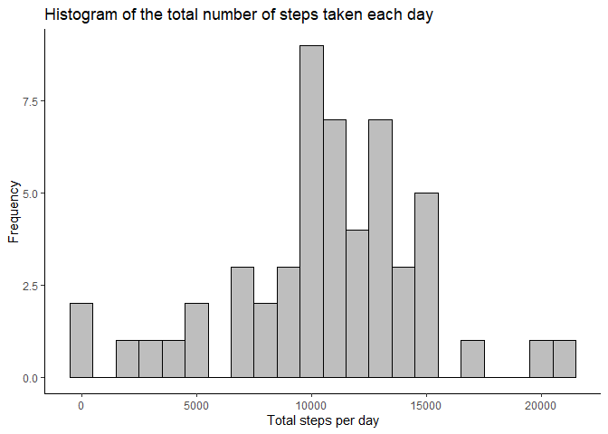
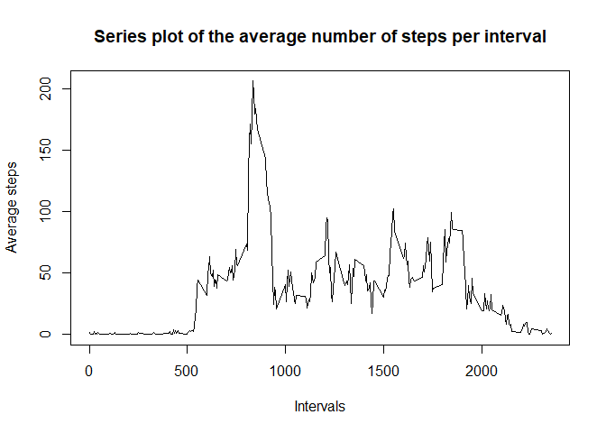
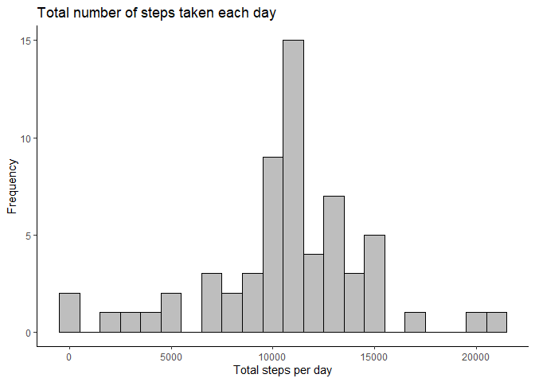

## Loading and preprocessing the data

#### 1. Load the data (i.e. \color{red}{\verb|read.csv()|}read.csv())  
First, we need to unzip the file with the ``unzip()`` function and then we use the ```read.csv()``` function to read the data we are going to work with. The data will be stored in a object called *data* .

```r
unzip("activity.zip",overwrite=TRUE)
data<-read.csv("./activity.csv",header = TRUE)
summary(data)
```

```
##      steps            date              interval     
##  Min.   :  0.00   Length:17568       Min.   :   0.0  
##  1st Qu.:  0.00   Class :character   1st Qu.: 588.8  
##  Median :  0.00   Mode  :character   Median :1177.5  
##  Mean   : 37.38                      Mean   :1177.5  
##  3rd Qu.: 12.00                      3rd Qu.:1766.2  
##  Max.   :806.00                      Max.   :2355.0  
##  NA's   :2304
```

#### 2. Process/transform the data (if necessary) into a format suitable for your analysis  
One thing we are going to do with the data is change the class of the date variable, so it can be read as a date format variable. Then we just look at the classes of the variables we have in the *data* dataset.

```r
data$date<-as.Date(data$date,"%Y-%m-%d")
sapply(data,class)
```

```
##     steps      date  interval 
## "integer"    "Date" "integer"
```


## What is mean total number of steps taken per day?


#### 1. Calculate the total number of steps taken per day  

To answer this question first we are going to sum the number of steps in all the intervals of each day, we store this information in a variable called *total.steps.per.day*. We use the function ````tapply()``` to make the sum, and the function ```with()``` to make the typing shorter.


```r
total.steps.per.day<-with(data,tapply(steps,date,sum))
```

#### 2. If you do not understand the difference between a histogram and a barplot, research the difference between them. Make a histogram of the total number of steps taken each day  
Then we are going to look at the Histogram of the total number of steps taken each day. Here we first call the `ggplot` package, and then we use the variable  *total.steps.per.day* as a dataframe to see the histogram.


```r
library(ggplot2)
ggplot(data=as.data.frame(total.steps.per.day),aes(total.steps.per.day))+
        geom_histogram(binwidth=1000,fill="grey",col="black")+
        labs(title = "Histogram of the total number of steps taken each day")+
        labs(x="Total steps per day")+
        labs(y="Frequency")+
        theme_classic()
```

```
## Warning: Removed 8 rows containing non-finite values (stat_bin).
```

<!-- -->

#### 3. Calculate and report the mean and median of the total number of steps taken per day
Finally we calculate the mean of the steps per day and the median of steps per day, and store them in variables.

```r
mean(total.steps.per.day,na.rm = TRUE)
```

```
## [1] 10766.19
```

```r
median(total.steps.per.day,na.rm = TRUE)
```

```
## [1] 10765
```

The mean of the total number of steps taken per day is **10766.19**.     
The median of the total number of steps taken per day is **10765**.  
As we saw in the graphic the distribution of the data is roughly normal, so we hope that the mean and the median are similar, and they actually were.


## What is the average daily activity pattern?

#### 1. Make a time series plot of the 5-minute interval (x-axis) and the average number of steps taken, averaged across all days (y-axis)   
  
with the function `aggregate` we crean a new object of the means by each interval
    

```r
intervales<-aggregate(data$steps~data$interval,FUN=mean)
```
  
Then we plot the data using the base plotting sistem of R with a plot type "l".  
  

```r
plot(intervales,type = "l",main="Series plot of the average number of steps per interval", xlab="Intervals",ylab="Average steps")
```

<!-- -->
  

  
#### 2. Which 5-minute interval, on average across all the days in the dataset, contains the maximum number of steps?   
  
Now we use the function `which.max()` to know what intervals has the gretest average of steps.    
  

```r
which.max(intervales$`data$steps`)
```

```
## [1] 104
```

```r
intervales$`data$interval`[which.max(intervales$`data$steps`)]
```

```
## [1] 835
```
  
the greatest average of steps is in the interval **835**, with **104** average steps.


## Imputing missing values
#### 1. Calculate and report the total number of missing values in the dataset (i.e. the total number of rows with NAs) 

To calculate the number of NAs in the dataset we use the function sum and then we ask which of the row is not complete, then we have the result.

```r
total.of.NAs<-sum(!complete.cases(data))
```

The total number of rows with NAs is **2304**


#### 2. Devise a strategy for filling in all of the missing values in the dataset. The strategy does not need to be sophisticated. For example, you could use the mean/median for that day, or the mean for that 5-minute interval, etc.  
  
Here we create a `newdata` object and a look for filling the NAs with the value of the mean in the previous data.  


```r
newdata<-data
for (i in 1:length(data$steps)){
        if(is.na(data$steps[i])){
                newdata$steps[i]<-intervales[data$interval==data$interval[i],2]
        }else{newdata$steps[i]<-data$steps[i]
        }
}
```
      
      

#### 3. Create a new dataset that is equal to the original dataset but with the missing data filled in.    
  
As the new data set was already created, we will just see how the first rows of the data frame look like. 
  

```r
head(newdata)
```

```
##       steps       date interval
## 1 1.7169811 2012-10-01        0
## 2 0.3396226 2012-10-01        5
## 3 0.1320755 2012-10-01       10
## 4 0.1509434 2012-10-01       15
## 5 0.0754717 2012-10-01       20
## 6 2.0943396 2012-10-01       25
```

        

#### 4. Make a histogram of the total number of steps taken each day and Calculate and report the mean and median total number of steps taken per day. Do these values differ from the estimates from the first part of the assignment? What is the impact of imputing missing data on the estimates of the total daily number of steps?  

 first we calculate the new sum of the steps of each interval per day with the aggredate function.
 Then we plot a histogram with the frequency of steps per day.  
 

```r
sum.p.day<-as.data.frame(with(newdata,tapply(steps,date,sum)))
sum.p.day<-data.frame(dates=row.names(sum.p.day),
                      steps=sum.p.day$"with(newdata, tapply(steps, date, sum))")


ggplot(data=sum.p.day,aes(steps))+
        geom_histogram(binwidth=1000,fill="grey",col="black")+
        labs(title = "Total number of steps taken each day")+
        labs(x="Total steps per day")+
        labs(y="Frequency")+
        theme_classic()
```

<!-- -->
  
  
  As you can see, the shape of the distribution didnt change significantly with the new values impute to the NA values.
   
Then we calculate the mean and the median and storage them in variables called *newmean* and *newmedian*.

```r
newmean<-mean(sum.p.day$steps)
        newmean
```

```
## [1] 10766.19
```

```r
newmedian<-median(sum.p.day$steps)
        newmedian
```

```
## [1] 10766.19
```
We can see that the mean and median are both **10766.19** . Very similar to those values from the previos part.


## Are there differences in activity patterns between weekdays and weekends?

#### 1. Create a new factor variable in the dataset with two levels – “weekday” and “weekend” indicating whether a given date is a weekday or weekend day.  

Here we create a week object with the days of the week with the help of the `lubridate` package and its function: `wday()`. Then we create a look that fill with weekend or weekday depending on the day of the week output.  


```r
library(lubridate)
```

```
## 
## Attaching package: 'lubridate'
```

```
## The following objects are masked from 'package:base':
## 
##     date, intersect, setdiff, union
```

```r
week<-as.character(wday(newdata$date,label=TRUE))

for (i in 1:length(week)) {
        if(week[i]=="sáb\\."){
               week[i]<-"weekend"
        }else if(week[i]=="dom\\."){
                week[i]<-"weekend"     
        }else{
                       week[i]<-"weekday"
               }
}
newdata$daytype<-as.factor(week)
```


#### 2. Make a panel plot containing a time series plot (type = "l") of the 5-minute interval (x-axis) and the average number of steps taken, averaged across all weekday days or weekend days (y-axis).   


Finally we use the `lattice` package to create a plot type "l" (series plot) and split it into weekeend and weekdays.


```r
library(lattice)


splitdata<-aggregate(newdata$steps~newdata$interval*newdata$daytype,FUN=mean)
names(splitdata)<-c("interval","daytype","steps")

xyplot(steps ~ interval | daytype,data = splitdata,type="l",layout=c(1,2))
```

<!-- -->


